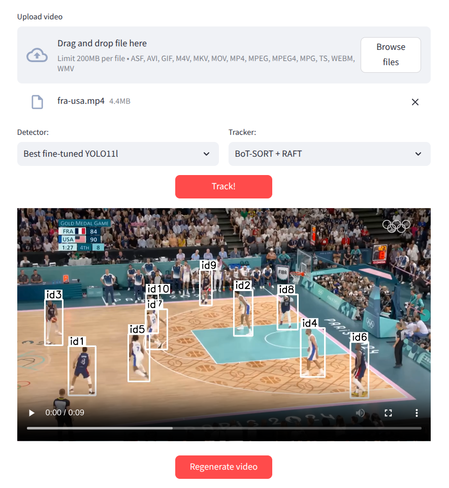

## Трекинг игроков в спорте

Цель проекта — сделать систему для real-time детектирования и отслеживания игроков по видеопотоку с трансляцией спортивного матча. Система будет состоять из двух частей: детектора, выделяющего всех игроков на каждом отдельном кадре, и трекера, отслеживающего движения конкретных игроков между разными кадрами.

### Веб-приложение

Baseline модель-детектор с трекером BoT-SORT можно протестировать с помощью веб-приложения на Streamlit.

#### Установка

Предполагается, что вы работаете в Unix-подобной системе и у вас установлены [Git](https://git-scm.com/) и [Docker Engine](https://docs.docker.com/engine/).

1. Склонируйте этот репозиторий: `git clone https://github.com/ludwig-n/player-tracking.git`
2. Зайдите в папку app: `cd player-tracking/app`
3. Поднимите сервер и клиент: `docker compose up`

Когда сервер и клиент запустятся, зайдите в браузере на http://localhost:8501.

#### Использование

Загрузите видеофайл с клипом из спортивной трансляции и нажмите **Track!**, чтобы отследить в нём игроков.

Приложение сгенерирует видео, где все найденные моделью игроки выделены рамкой и для каждого определён id.

Снизу откроется интерфейс, где перечислены все игроки и для каждого указан его id, картинка и временные отметки в видео, где он появляется.

Интерфейс позволяет кастомизировать отображение этих игроков в сгенерированном видео:

- В поле **Custom label** можно записать имя игрока, которое будет отображаться над его рамкой вместо "id<номер>".
- Можно отключить галочку **Highlight in main video**, чтобы игрок не выделялся рамкой в видео вообще. Эта функция позволяет сгенерировать видео, где отмечены только несколько ключевых игроков. С этим помогут кнопки **Deselect all** и **Select all**, отключающие и включающие эту галочку у всех игроков соответственно.

После внесения изменений в эти настройки нажмите кнопку **Regenerate video** сверху, чтобы видео сгенерировалось заново с вашими изменениями.

Наконец, кнопка **Get focused video** создаёт отдельное видео, показывающее перемещения только этого игрока. Оно появляется прямо на месте этой кнопки, т. е. на экране может быть несколько таких видео для разных игроков одновременно.

Чтобы отследить игроков на другом видео, загрузите новое видео вверху страницы и снова нажмите **Track!**. Интерфейс обновится автоматически.
