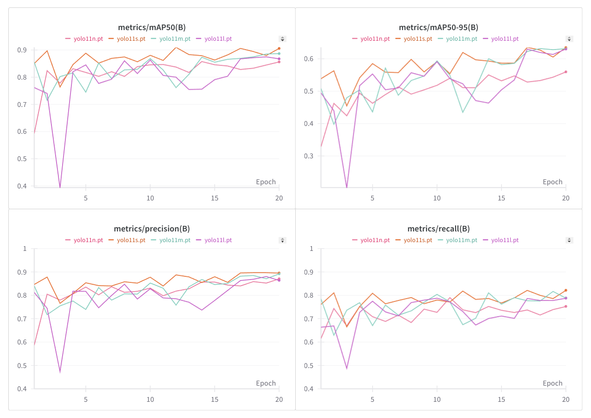

## Baseline

В качестве бейзлайна я взял модель [YOLO11](https://docs.ultralytics.com/models/yolo11/), дообученную на нашей train выборке в течение 20 эпох с параметрами по умолчанию от Ultralytics. Конкретно я взял модель `yolo11s` на 9.4 млн параметров. Код обучения, метрики и пример инференса в файле [`baseline.ipynb`](baseline.ipynb).

Я также пробовал дообучать модели `yolo11n`, `yolo11m` и `yolo11l`, но с дефолтовыми гиперпараметрами они показали результаты не лучше. Код их обучения совпадает с кодом обучения основной модели, поэтому я не стал выносить его в отдельный файл. Достаточно поменять название модели во второй ячейке ноутбука [`baseline.ipynb`](baseline.ipynb). Графики зависимости основных метрик от эпохи для всех четырёх моделей приведены ниже.

В качестве основной метрики для модели-детектора я буду использовать mAP, т. к. это стандартная метрика для задач детекции. Бейзлайн (дообученная `yolo11s`) на нашей валидационной выборке показывает mAP@50 = 0.889, mAP@50-95 = 0.608.
